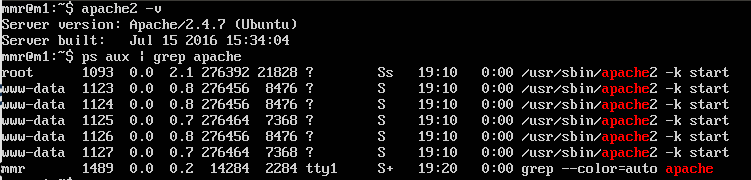

# Práctica 1
El entorno de virtualización utilizado es *Virtualbox* y el sistema operativo para mi máquina virtual es *Ubuntu Server 14.04*. 
En la siguiente imagen podemos apreciar los resultados de la ejecución de los comandos `apache2 -v` y `ps aux | grep apache`:

