# Práctica 2
Lo primero que haremos será anotar las direcciones IPs de las máquinas. Para ello ejectuamos el comando `ifconfig` en ambas máquinas. En la máquina 1 obtenemos:
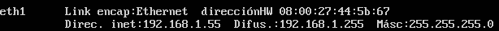
Y en la máquina 2:
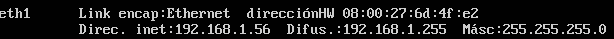

Una vez conocidas las IPs, es conveniente destacar que en esta práctica nuestra máquina de trabajo será la máquina 2 (identificada por **m2**) por lo general. Ésta será la que se encargue de duplicar exactamente el contenido que nos interese de la máquina 1 (identificada por **m1**).

Así pues, comprobamos que ambas máquinas se ven entre sí mediante la utilidad `ping`. En la máquina 1:
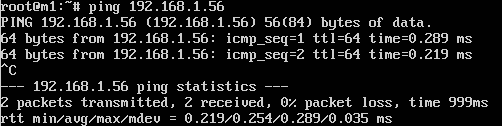
Y en la máquina 2:
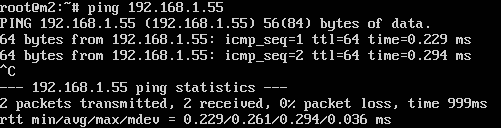

Personalmente, he decidido trabajar siempre como **root**, por tanto debemos configurar el fichero */etc/ssh/sshd_config* de la máquina 1, ya que será nuestro servidor en producción. Modificaremos el parámetro *PermitRootLogin* tal y como se muestra en la siguiente figura:
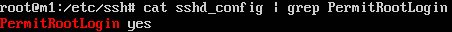
A continuación, reiniciamos el servicio con el comando `service restart ssh`.

Comprobamos que, efectivamente, podemos conectarnos como root por ssh desde la máquina 2 a la máquina 1:
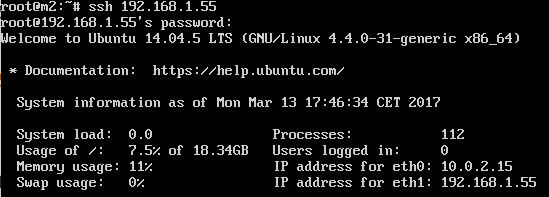

Lo siguiente a comprobar es el clonado de un directorio de la máquina 1 (*/var/www*, por ejemplo) a la máquina 2 mediante *rsync*. Para ello, crearemos un archivo de prueba en la máquina 1 en */var/www/html/hola.html*:
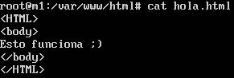
Y ejecutamos `ls` en la máquina 2 para comprobar que efectivamente no existe ese archivo en la máquina 2:
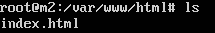
Ahora, ejecutamos en la máquina 2 el siguiente comando `rsync -avz -e ssh root@192.168.1.55:/var/www/ /var/www/`, que será el encargado de clonar el directorio, y por consecuente, el nuevo archivo que hemos creado de prueba (*hola.html*):
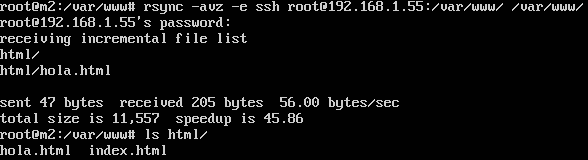

Como hemos visto, cada vez que usamos *rsync*, debemos introducir la contraseña de la máquina 1, ya que utiliza *ssh*. Así pues, configuraremos *ssh* para que no nos pida más la contraseña y poder automatizar el proceso de clonado.

Lo primero que haremos será ejecutar el comando `ssh-keygen -t dsa` para generar el par de claves pública-privada en la máquina 2. Una vez hecho esto, tendremos que copiar la clave pública a la máquina 1. Lo hacemos ejecutando el comando `ssh-copy-id -i -ssh/id_dsa.pub root@192.168.1.55`. Todo el proceso se encuentra descrito en la siguiente imagen:
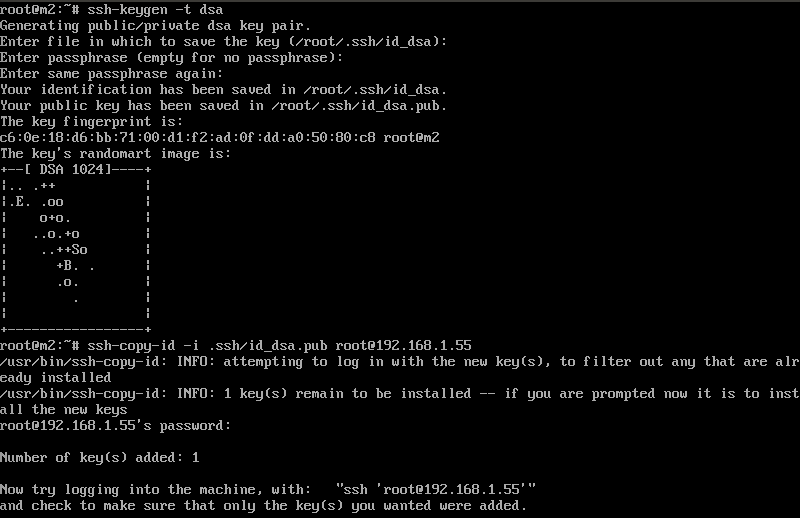

A continuación, comprobamos que podemos conectarnos a la máquina 1 sin introducir la contraseña:
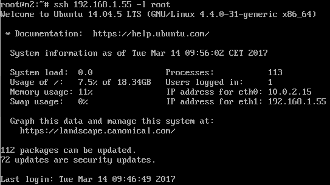

Por último, configuraremos *crontab* para automatizar la ejecución del comando `rsync -avz -e ssh root@192.168.1.55:/var/www/ /var/www/`.
Así pues, editamos el archivo */etc/crontab* y le añadimos lo siguiente: `* * * * * root rsync -avz -e ssh root@192.168.1.55:/var/www/ /var/www/`. Esto permitirá que se ejecute el comando automáticamente cada minuto. 

Para la prueba, borraremos el fichero */var/www/html/hola.html* de la máquina 2 creado anteriormente, y veremos como se sincroniza automáticamente.
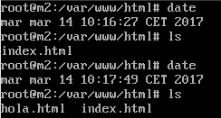