# Práctica 3
Por compatibilidad con la red local, he decidido cambiar la red virtual a la IP `192.168.2.0`, por lo tanto todas las IPs de las máquinas virtuales pertenecerán a esta red, aunque la parte de host se mantendrá igual que en la práctica 2.

Instalamos dos nuevas máquinas, que serán nuestros balanceadores de carga, tal y como hicimos en la primera práctica, pero esta vez sin instalar *Apache*. Les hacemos la misma configuración de red para que se puedan ver todas entre todas y también con la anfitriona.
El balanceador de carga con *NGinx* tendrá la IP `192.168.2.57` y el balanceador de carga con *Haproxy* tendrá la IP `192.168.2.58`. Aunque suponemos que no estarán los dos balanceadores activos a la vez, he preferido poner IPs distintas para evitar problemas.

La organización de las máquinas y sus IPs asociadas se puede ver en la siguiente figura:

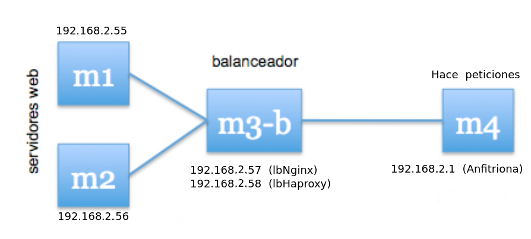

## Balanceo de carga con *NGinx*
Tras instalar *NGinx*, configuramos el fichero `/etc/nginx/conf.d/default.conf` tal y como se muestra en la figura, para obtener un balanceo *Round-Robin*:

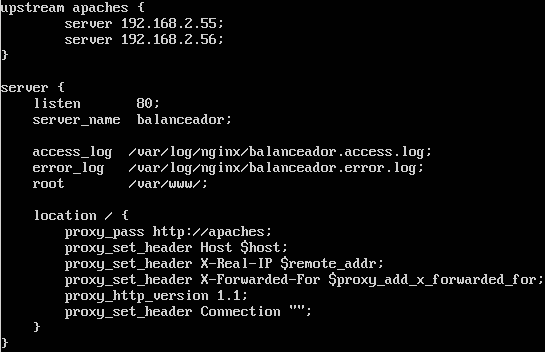

Para comprobar que todo funciona como debería, modificaremos las páginas HTML de inicio de los dos servidores finales para distinguirlos. Los archivos quedan como se muestra en la siguiente figura:

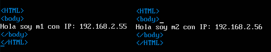

Hacemos peticiones con la máquina anfitriona (prompt en letra morada) a la IP del balanceador (`192.168.2.57`) para comprobar que todo funciona correctamente:

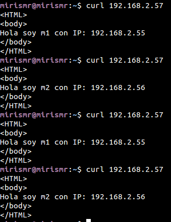

A continuación, modificamos los pesos de las máquinas finales de la siguiente forma: 

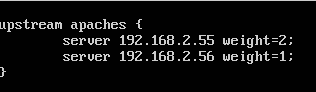

Así, de cada tres peticiones, la máquina 1 atenderá dos peticiones mientras que la máquina 2 atenderá una petición:

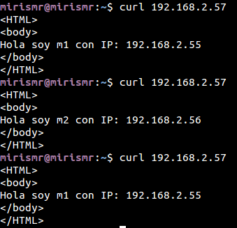

## Balanceo de carga con *Haproxy*

Tras instalar *Haproxy*, configuramos el fichero `/etc/haproxy/haproxy.cfg` tal y como se muestra en la figura, para obtener un balanceo *Round-Robin*:

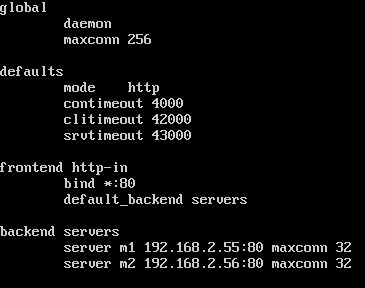

Hacemos peticiones con la máquina anfitriona (prompt en letra morada) a la IP del balanceador (`192.168.2.58`) para comprobar que todo funciona correctamente:

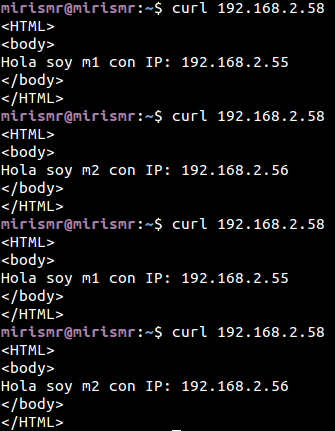

A continuación, modificamos los pesos de las máquinas finales de la siguiente forma: 

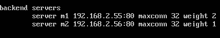

Así, de cada tres peticiones, la máquina 1 atenderá dos peticiones mientras que la máquina 2 atenderá una petición:

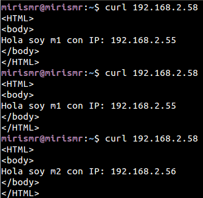

## Someter a una alta carga a *NGinx* y a *Haproxy*

Tras ejecutar el comando `ab -n 1000 -c 10 http://192.168.2.5X/index.html` se obtienen los siguientes resultados. Para *NGinx*:

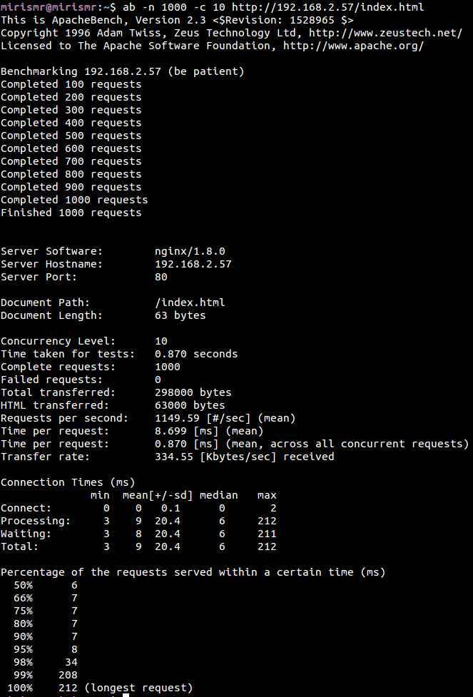

Y para *Haproxy*:

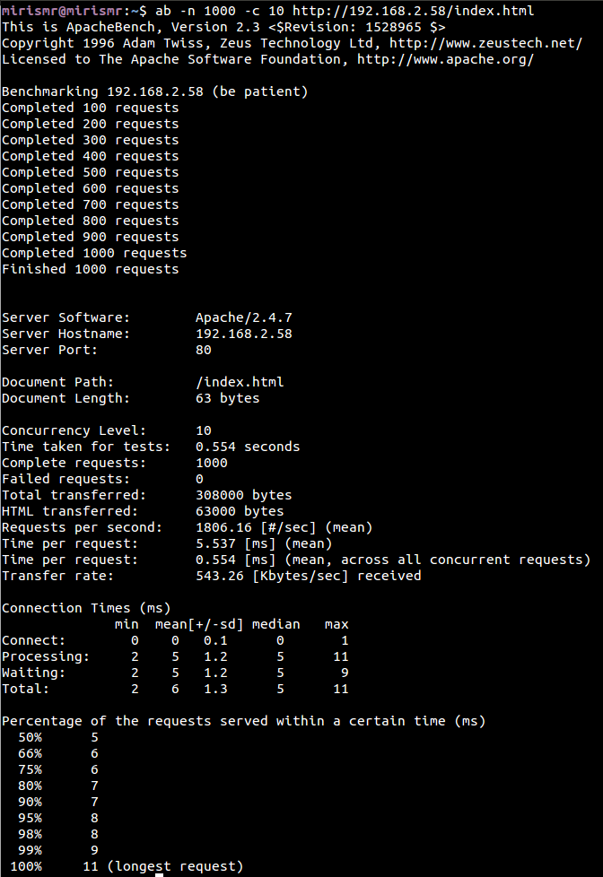

Podemos concluir que *Haproxy* tarda menos en realizar el tests, a la vez que transfiere más bytes. Además, *Haproxy* responde más peticiones por segundo que *NGinx*, y esto se ve implicado en que el bitrate de transferencia en *Haproxy* sea también mayor.

## Opcional: Configuración de *Pound*
Creamos una nueva máquina virtual donde instalaremos *Pound*. La dirección IP se muestra en la siguiente figura:

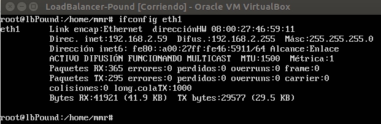

Instalamos *Pound* con el comando `apt-get install pound`. El fichero de configuración es `/etc/pound/pound.cfg`, que lo configuraremos de la siguiente forma:

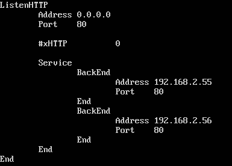

Y, efectivamente, comprobamos que funciona haciéndole peticiones desde la máquina anfitriona:

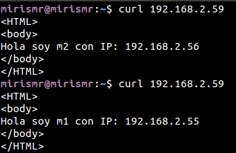