# Práctica 4
## Instalar certificado SSL autofirmado 
Para empezar, activaremos el módulo de *SSL* en *Apache* y generamos el certificado autofirmado: 

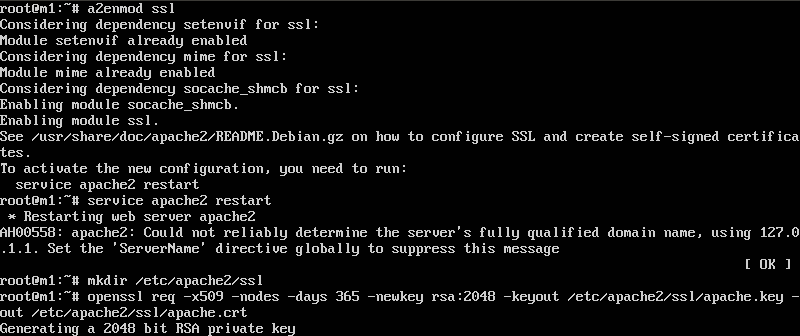
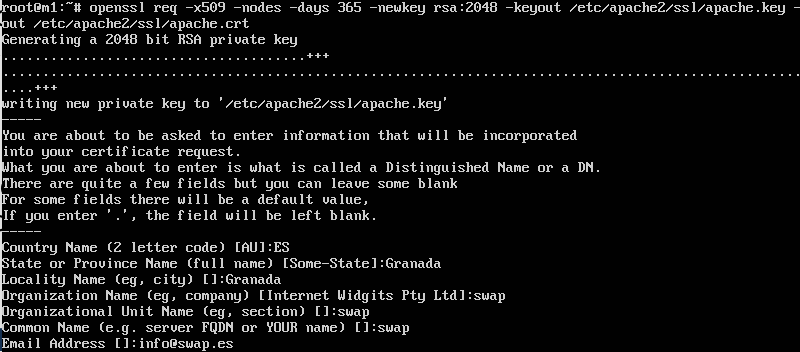

Una vez hecho esto, debemos indicarle a *Apache* dónde se encuentran el archivo del certificado (.cert) y la clave (.key). Para ello, modificamos el archivo de configuración `/etc/apache2/sites-available/default-ssl.conf`.

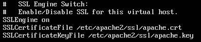

Por último, activamos el sitio *default-ssl* y reiniciamos *Apache*:

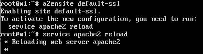

Para comprobarlo, introducimos en el navegador la dirección del servidor precedida de *https*. En mi caso sería `https://192.168.2.55` para la máquina 1. El resultado se puede comprobar en la siguiente figura:

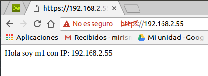

Realizamos el mismo procedimiento para la máquina 2. En este caso, como ya tenemos el certificado, solo tendremos que copiarlo a la máquina 2 y realizar los cambios oportunos (vistos anteriormente) en el archivo de configuración. Para copiar el certificado, me he servido de la útil herramienta *Rsync* utilizada en prácticas anteriores. En la siguiente figura se puede observar el comando usado:

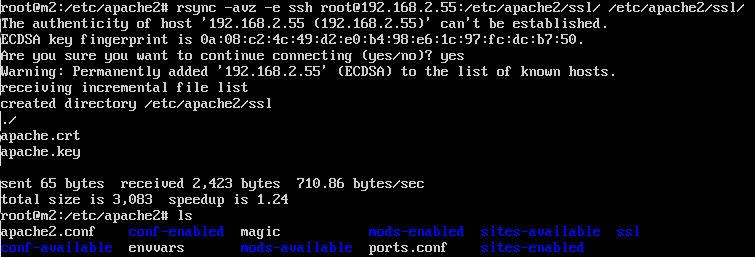

Por último, comprobamos que efectivamente, se usa el certificado accediendo a nuestra máquina 2 con el navegador, igual que lo hicimos antes. El resultado se observa en la figura siguiente:

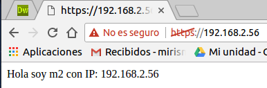

## Opcional 1: Instalar certificado SSL en balanceador (*Nginx*)
Copiamos el certificado generado anteriormente para las máquinas finales en el balanceador. En mi caso, guardamos los ficheros asociados al certificado en `/etc/nginx/ssl`. No importa el directorio donde lo tengamos almacenado, pero si es importante recordar la ruta, ya que será usada posteriormente.
Una vez hecho esto, modificamos el fichero de configuración de *Nginx*, ubicado en `/etc/nginx/conf.d/default.conf`, tal y como se muestra en la siguiente figura:

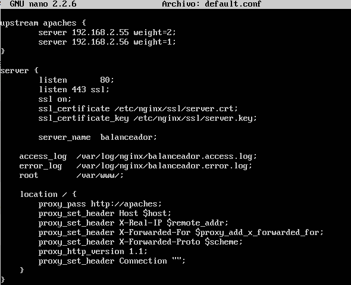

Aquí le indicamos que escuche también en el puerto 443, que corresponde a *SSL*, activamos *SSL* e indicamos la ruta del certificado.
A continuación ejecutamos el comando `service nginx configtest`, para comprobar que el fichero de configuración es correcto, tal y como podemos ver en la siguiente figura:

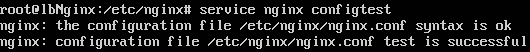

Podemos comprobar que, efectivamente, ahora si accedemos desde el navegador a la IP del balanceador, accederemos por *HTTPS*:

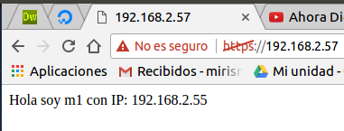

## Configuración del cortafuegos
En primer lugar, borramos todas las reglas de *iptables* y rechazamos todo el tráfico para comprobar que efectivamente funcionará nuestro script final. Para ello, ejecutamos los comandos que se pueden apreciar en la siguiente figura:

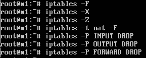

Así pues, por ejemplo, intentamos acceder al servidor por *HTTPS* y observamos como no nos deja conectarnos:

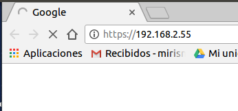

A continuación, escribimos el script que permitirá las conexiones tanto por *HTTP* como por *HTTPS*. Podemos verlo en la siguiente figura:

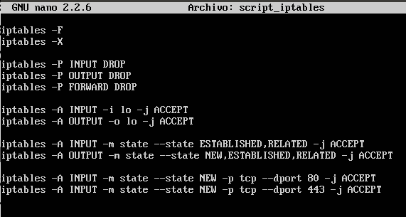

Por último solo nos queda comprobar que se conecta por ambos protocolos. Lo podemos ver en las siguientes figuras:

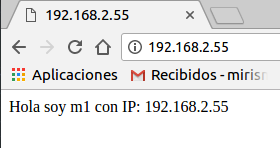
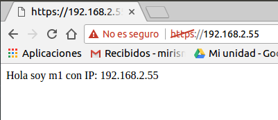

Por último, para que esta configuración de *iptables* siempre esté efectiva, necesitamos añadirla al arranque de nuestro servidor. Para ello, editamos el archivo `/etc/crontab` para que el proceso *crontab* ejecute el script anterior cada vez que se arranque el sistema. La línea a añadir en este fichero es la siguiente:

Reiniciamos y comprobamos que efectivamente siguen las reglas que definimos en el script incluso después de reiniciar:

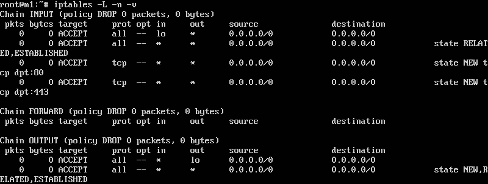

##Opcional 2: Configuración del cortafuegos en máquina específica
Añadimos una nueva máquina a nuestra granja web. Esta se llamará *cortafuegos* y tiene la IP *192.168.2.60*. El balanceador que usaremos será el utilizado en la opcional 1, es decir, el balanceador con *NGinx* con IP *192.168.2.57*.

Para empezar, ponemos la política de aceptar todo en nuestro balanceador, pues ahora la responsabilidad de aceptar o denegar tráfico la tendrá nuestra máquina *cortafuegos*. Así pues, ejecutamos el script correspondiente para hacer esta tarea en el balanceador:

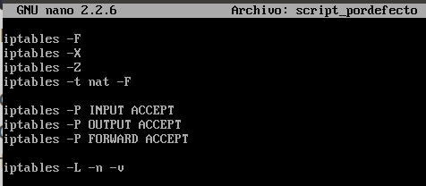

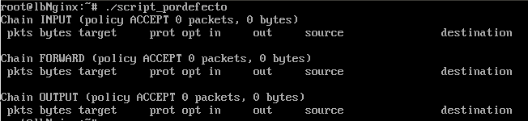

A continuación, configuramos el script de *iptables* para el cortafuegos:

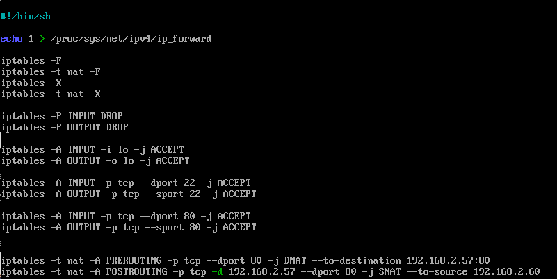

Por último, solo nos queda comprobar que si hacemos una petición al cortafuegos, éste la redirigirá al balanceador, y el balanceador a su vez, a alguna de las dos máquinas finales.

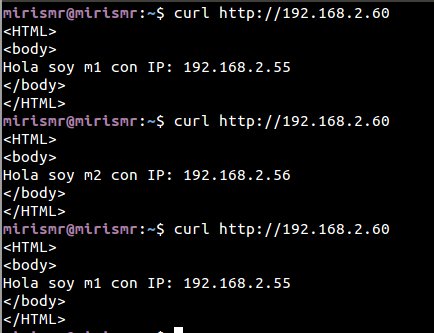

Si queremos acceder con *HTTPS* para hacer uso de las cuestiones anteriores de la práctica, podemos modificar el script como sigue para permitir el tráfico *HTTPS*:

Y comprobamos que funciona correctamente:

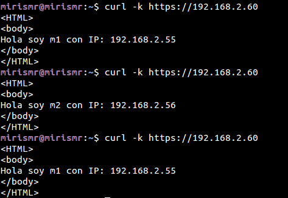
