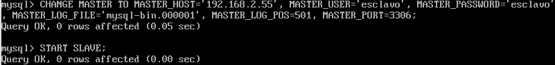

# Práctica 5
## Crear base de datos en *MySQL*

Lo primero que haremos será crear la base de datos en *MySQL*. Para ello entramos com usuario *root* con el comando `mysql -uroot -p`, e introducimos la contraseña. A continuación creamos la base de datos y una tabla de ejemplo. Además, introducimos algunos registros tal y como se muestra en la siguiente figura: 

## Replicar la base de datos con *mysqldump*

Para replicar la base de datos, lo primero que tenemos que hacer es bloquear las tablas para que no se pueda escribir mientras la estamos replicando, para ello se introduce el siguiente comando:

Obviamente, para introducir este comando tenemos que estar en la consola de *mysql*, es decir, entrando con el comando inicial `mysql -uroot -p`.

A continuación introducimos el comando de *mysqldump* para exportar los datos a un archivo *.sql*:

Y volvemos a desbloquear las tablas para futuras modificaciones:

Ahora en nuestra máquina esclavo (máquina 2), copiaremos el archivo creado anteriormente mediante *scp*. Una vez copiado, hay que crear la base de datos antes de poder restaurarla mediante el archivo ya que esto no lo incluye *mysqldump*. El proceso se muestra en la siguiente imagen:

Comprobamos que se ha restaurado perfectamente:

## Replicación de la base de datos maestro-esclavo

Para empezar debemos configurar el maestro. Para ello editamos el archivo `/etc/mysql/my.cnf`, tal y como se muestra en la siguiente figura:

Y a continuación reiniciamos el servicio con el comando `/etc/init.d/mysql restart`.
Ahora entramos en la consola de *mysql* e introducimos los comandos de la siguiente figura, con ello, crearemos un usuario para la máquina esclava:

Para la configuración del esclavo, haremos la misma operación pero en `server-id` pondremos `server-id=2`:

Y a continuación reiniciamos el servicio con el comando `/etc/init.d/mysql restart`.
Ahora entramos en la consola de *mysql* e introducimos los comandos de la siguiente figura para indicar quién es el maestro en la máquina esclava:

Por último, volvemos al maestro y desbloqueamos las tablas con `UNLOCK TABLES;`.
Para comprobar que todo funciona correctamente, en la consola *mysql* del esclavo, introducimos `SHOW SLAVE STATUS\G`. Nos tiene que salir algo parecido a la siguiente figura:

Para comprobar que todo funciona correctamente, insertaremos datos en la máquina maestra y veremos como se replican en la esclava:

