# Práctica 6
## Configuración RAID por software

Instalamos *mdadm* para configurar nuestro RAID por software. Para ello ejecutamos `apt-get install mdadm`.

Usamos el comando `fdisk -l` para encontrar información acerca de los discos. El resultado debe sesr similar al siguiente:

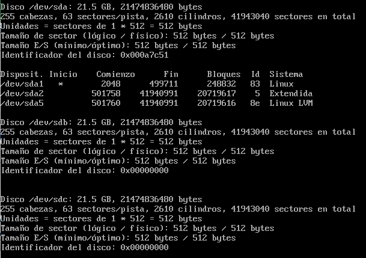

Una vez hecho esto, creamos el RAID 1, usando el dispositivo `/dev/md0` con el siguiente comando:

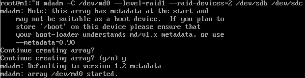

Le indicamos el nivel del RAID, los dispositivos y el número de dispositivos a usar.

A continuación, le damos formato a `/dev/md0` con la utilidad *mkfs*, la cual inicializa el formato *ext2*. Se muestra en la siguiente figura:

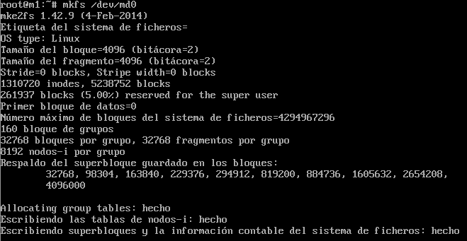

Lo siguiente será crear el directorio donde se montará el RAID y, evidentemente, montarlo. Para ello ejecutamos los comandos `mkdir /dat` y `mount /dev/md0 /dat`, como se muestra en la figura:

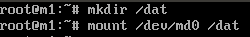

Para comprobar que todo ha ido correctamente podemos ejecutar `mount` y `mdadm --detail /dev/md0`:

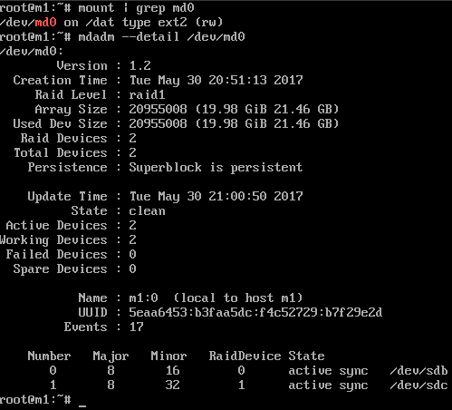

Por último, debemos configurar el sistema para que se monte el dispositivo al arrancar el sistema. Así que lo que debemos hacer es obtener el *uuid* de nuestro dispositivo. Para ello ejecutamos `ls -l /dev/disk/by-uuid/`:

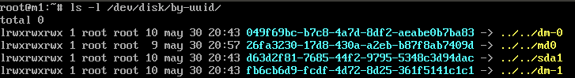

Con esta información añadiremos la línea correspondiente en el archivo `/etc/fstab`:

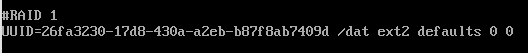

Para comprobar que funciona como debería, simularemos un fallo en uno de los discos, en concreto en `/dev/sdb`. Así pues, lo primero creamos un archivo de prueba en el directorio de montaje del RAID para poder comprobar después que se puede acceder aún habiendo fallado y retirado el dispositivo.

Para simular un fallo introducimos el comando `mdadm --manage --set-faulty /dev/md0 /dev/sdb` y observamos en el estado del RAID que ha fallado el dispositivo:

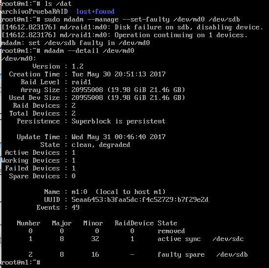

A continuación lo eliminamos con el comando `mdadm --manage --remove /dev/md0 /dev/sdb` (simulando la retirada "en caliente") y comprobamos que se ha eliminado del RAID:

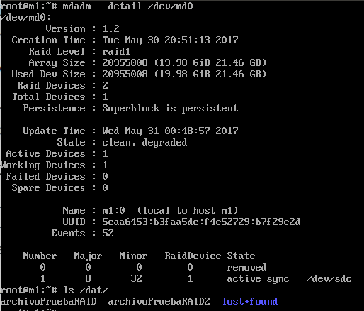

A pesar de haberlo eliminado, en la figura anterior se puede observar que podemos seguir viendo el archivo creado de prueba, y además crear otro archivo sin problema.

A continuación volvemos a añadir el disco tal y como se muestra en la siguiente figura y comprobar que están los dos archivos, el inicial y el creado después de retirar el dispositivo:

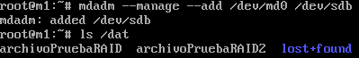

Como observación hay que recalcar que añadir el dispositivo de nuevo no es una tarea inmediata ya que se tienen que volver a sincronizar los datos, por tanto, antes de poder ver los datos en el dispositivo recién añadido debemos esperar un determinado tiempo. Si observamos los detalles con el comando `mdadm --detail /dev/md0` nos saldrá algo parecido a la siguiente figura:

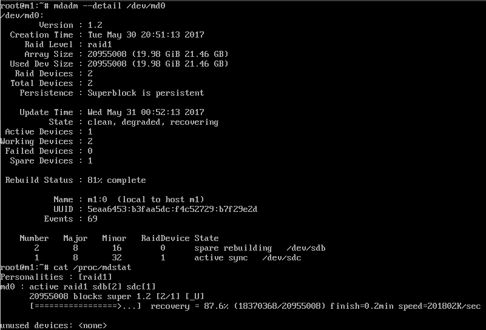

Lo que significa que están restaurándose los datos de nuevo. Si queremos ver el proceso, podemos observar el archivo `/proc/mdstat`, el cual nos informará del estado en el que se encuentra el dispositivo (con porcentajes y otras métricas interesantes).

Podemos comprobar que se encuentra finalizado el proceso de restauración:

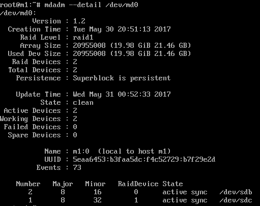
