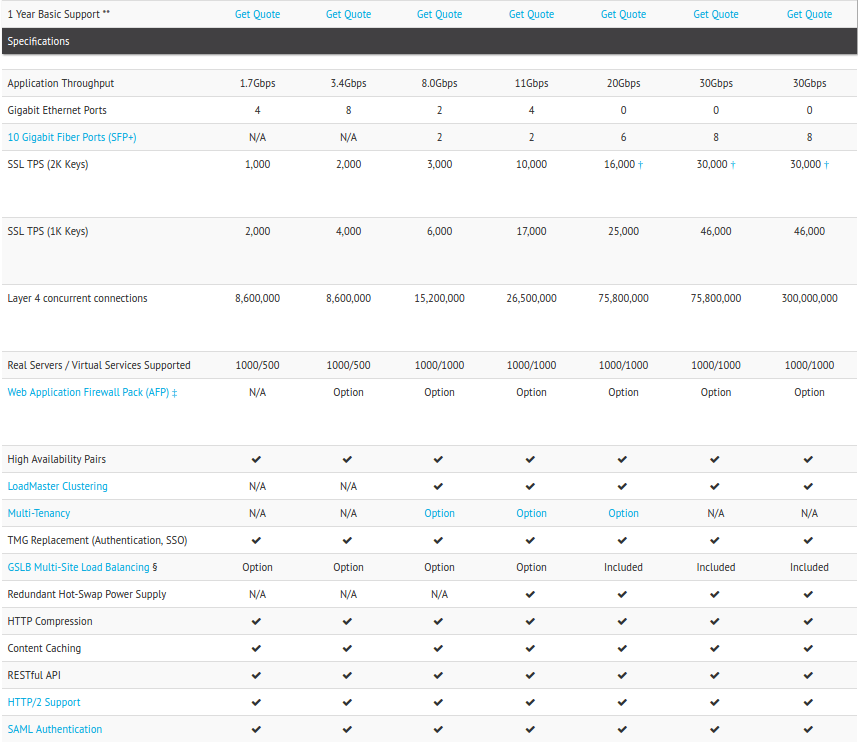
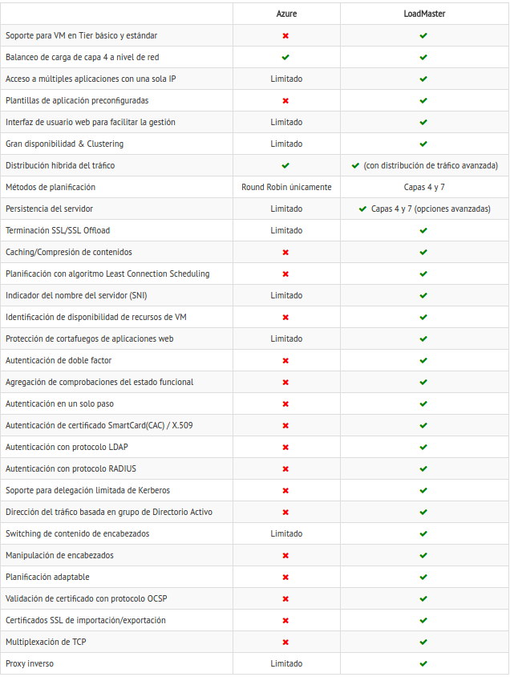

# Ejercicio 2

## Buscar información sobre precio y características de balanceadores hardware específicos. Compara las prestaciones que ofrecen unos y otros.
Distintos modelos de *Kempt Technologies*:

El precio no está disponible en la web.

En la siguiente tabla, se encuentra una comparación entre el balanceador de carga de *Azure* y un modelo de *Kempt Technologies*:

De nuevo, el precio de ambos no está disponible en la web y hay que rellenar un formulario con información personal para obtener el presupuesto.

A modo de curiosidad, *Aruba Cloud* propone una solución de servicios cloud para balanceadores de carga. Se puede ver en la tercera referencia.

## Referencias
1. [Kemp Technologies](https://kemptechnologies.com/es/server-load-balancing-appliances/product-matrix.html "Kemp Technologies")
2. [Azure vs Kemp](https://kemptechnologies.com/es/azure/azure-load-balancing-traffic-management-comparison-guide/ "Azure vs Kemp")
3. [Aruba Cloud](https://www.arubacloud.es/cloud-computing/balanceadores-de-carga.aspx "Aruba Cloud")
